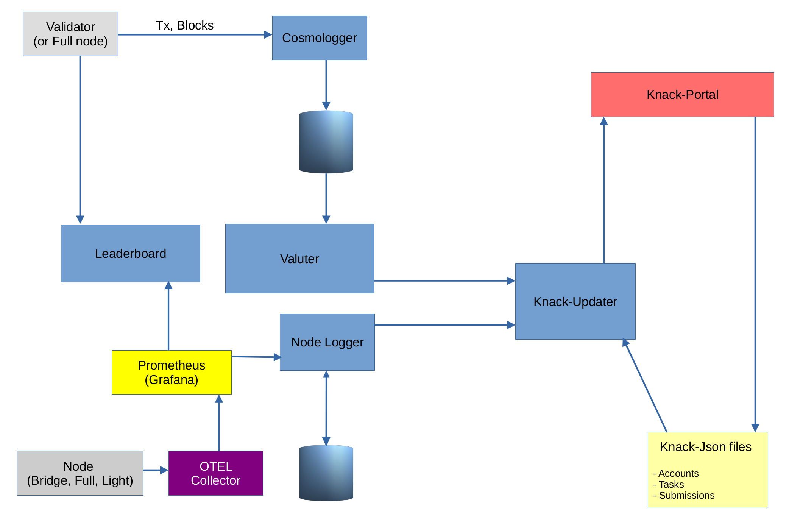

# Celestia all-in-one is a minimal local setup for Celestia tool chains with metrics

This bundle sets up the following tools and configures them to work together in a local environment:

* [Celestia-app](https://github.com/celestiaorg/celestia-app)
* [Celestia-node](https://github.com/celestiaorg/celestia-node/)
* [Cosmologger](https://github.com/celestiaorg/cosmologger)
* [Valuter](https://github.com/celestiaorg/valuter)
* A [postgres database](https://www.postgresql.org/) instance
* [Postgres admin](https://www.pgadmin.org/)
* [OTEL collector](https://github.com/open-telemetry/opentelemetry-collector)
* [Prometheus](https://prometheus.io/)
* [Leaderboard backend](https://github.com/celestiaorg/leaderboard-backend/)
* [Nodelogger](https://github.com/celestiaorg/nodelogger)
* A script that submits random PFDs

## Setup & Run

First you need to install [docker-compose](https://docs.docker.com/compose/).
Then run the following

```bash
git clone https://github.com/celestiaorg/celestia-local-docker.git
cd celestia-local-docker
docker-compose up -d
```

**Note:** you may need to use `sudo` (or equivalent on a different OS) if docker username is not added to your privileged group.

### Build containers

If you need to build containers from source code, run the following command:

```bash
docker-compose build
```

**Note:** this works only on public repositories. For private repos, you need to use an advance configs.

## Status of the containers

```bash
docker-compose ps
```
```sh
       Name                      Command                       State                         Ports              
----------------------------------------------------------------------------------------------------------------
celestia-app          /app/start.sh                    Up (healthy)            0.0.0.0:26657->26657/tcp,:::26657
                                                                               ->26657/tcp, 0.0.0.0:9092->9092/t
                                                                               cp,:::9092->9092/tcp             
celestia-node         /app/start.sh                    Up (health: starting)                                    
cosmologger           ./app                            Up (healthy)            0.0.0.0:2345->2345/tcp,:::2345->2
                                                                               345/tcp                          
leaderboard-backend   ./app                            Up (healthy)            0.0.0.0:5051->5051/tcp,:::5051->5
                                                                               051/tcp                          
nodelogger            ./app                            Up (unhealthy)          0.0.0.0:2348->2345/tcp,:::2348->2
                                                                               345/tcp, 0.0.0.0:5050->5050/tcp,:
                                                                               ::5050->5050/tcp                 
otel-collector        /otelcol --config=/root/ot ...   Up                      0.0.0.0:4317->4317/tcp,:::4317->4
                                                                               317/tcp, 0.0.0.0:4318->4318/tcp,:
                                                                               ::4318->4318/tcp, 55678/tcp,     
                                                                               55679/tcp, 0.0.0.0:8889->8889/tcp
                                                                               ,:::8889->8889/tcp               
pgadmin               /entrypoint.sh                   Up                      443/tcp, 0.0.0.0:5555->80/tcp,:::
                                                                               5555->80/tcp                     
postgres              docker-entrypoint.sh postgres    Up (healthy)            5432/tcp                         
prometheus            /bin/prometheus --web.enab ...   Up                      0.0.0.0:9090->9090/tcp,:::9090->9
                                                                               090/tcp                          
random-pfd            /app/start.sh                    Up                                                       
valuter               ./app                            Up (healthy)            0.0.0.0:2346->2345/tcp,:::2346->2
                                                                               345/tcp, 0.0.0.0:8080->8080/tcp,:
                                                                               ::8080->8080/tcp
```

## See the logs

```bash
docker-compose logs -f random-pfd
```

```sh
random-pfd             | Waiting 4 seconds...
random-pfd             | Submiting 7 PFDs...
random-pfd             | 
random-pfd             | 	2883 6042FF33664A39726508E2EE30A09E444E02A1CF279CB03E0D9570CF28106905
random-pfd             | 	2884 CD292558FCD99852E0A40B5DB1E5BDBBD0985ECE4154B09B918865A46B59F72F
random-pfd             | 	2885 D6FD4CA2C3F0C3B1CD0816B19E1CB073D177A8EB4B35D3A17B9E0F2AA3565FB5
random-pfd             | 	2886 985B998195D2A9B3B1387B565DDBC1A68BB881F84AF0E82BF8E07F6FEA439066
random-pfd             | 	2887 91D10450B8D7DBAAD27E8613E7F0C896015E8B09428FFF9651AE3AA2F11965C7
random-pfd             | 	2888 44BFE7813184329CA5E9D7E192691288FDBFD58F8B1774F355D96588F73F9FEB
random-pfd             | 	2889 62B116D5E69C4D83F99D60C22DEBA5C4114FF6F2B69B4825C04A991DCC2DD6ED
random-pfd             | 
random-pfd             | Waiting 1 seconds...
random-pfd             | Submiting 18 PFDs...
random-pfd             | 
random-pfd             | 	2891 4FECAAC0459D40A2423AC05E95810E1171828CC5A35352013A7C147ABE3973B2
random-pfd             | 	2892 2664826F2795FA8D05EFB6B8B49A86D807AED2B0CBCCE5E94BF37A4DD63C278D
random-pfd             | 	2893 317EE597B8B876D63DB2CE4F35DDAC9F626F25FE3B4FE9AFDE1EBEFB51350387
random-pfd             | 	2894 F2AE5354527846F855EF26D4DBE630D3D8C576463A2483ACFBBB597D6BBCCF27
random-pfd             | 	2895 8A1F85345794B0630143C991B608E34204F9F827D8E41DAEE0E973AF5F8199B5
random-pfd             | 	2896 01C968F7EDDCB1DF881FDFFD66FDBDEB76E04DF34078389304390EDC5C81D752
```

## API endpoints

These are default endpoints, if you wanna change the port numbers, you can do it in the `.env` file.

* Celestia-app: http://localhost:26657
* Celestia-node: http://localhost:26659/header/10
* Valuter: http://localhost:8080
* Leaderboard-backend: http://localhost:5051
* Nodelogger: http://localhost:5050
* Pgadmin: http://localhost:5555
* Prometheus: http://localhost:9090

## ENV vars

Config vars can be modified in the `.env` file. The default values are listed here:

```ini
# OTEL collector
OTEL_GRPC_PORT="4317"
OTEL_HTTP_PORT="4318"
OTEL_PROMETHEUS_EXPORTER="8889"

# Prometheus
PROMETHEUS_PORT="9090"
PROMETHEUS_URL="http://prometheus:${PROMETHEUS_PORT}"
# PROMETHEUS_URL="https://<userid>:<API_KEY>@prometheus-prod-10-prod-us-central-0.grafana.net/api/prom"

# Celestia Core/App
DENOM="utia"
VALIDATOR_KEY="validator"
CHAINID="test"
KEYRING_BACKEND="test"
APP_HOME_DIR="/root/.celestia-app"
CORE_IP="celestia-app"
CORE_RPC_PORT="26657"
CORE_GRPC_PORT="9092"
APP_NODE_GRPC_TLS="false"

APP_GIT_TAG="v0.11.1"

# Celestia Node
NODE_GIT_TAG="v0.6.1"

NODE_KEY="my_celes_key"
FUND_AMOUNT="5000000000${DENOM}"
NODE_EXPORTED_KEY_FILE="nodeKey.txt"

NODE_TYPE="bridge"

METRICS_ENDPOINT="otel-collector:${OTEL_HTTP_PORT}"
NODE_RPC_PORT="26658"
NODE_RPC_URL="http://celestia-node:${NODE_RPC_PORT}"
NODE_REST_PORT="26659"
NODE_REST_HOST="celestia-node"
NODE_REST_URL="http://${NODE_REST_HOST}:${NODE_REST_PORT}"


# Valuter
VALUTER_PORT=8080
VALUTER_SERVING_ADDR=:${VALUTER_PORT}

# Database
POSTGRES_DB=celestiadb
POSTGRES_USER=root
POSTGRES_PASSWORD=password
POSTGRES_PORT=5432
POSTGRES_HOST=postgres
PGADMIN_PORT=5555

# Cosmologger
RPC_ADDRESS=tcp://${CORE_IP}:${CORE_RPC_PORT}
GRPC_ADDRESS=${CORE_IP}:${CORE_GRPC_PORT}
GRPC_TLS=false
DATA_COLLECTION_MODE=event

# Nodelogger
NODELOGGER_LOG_LEVEL="info"
# in seconds
NODELOGGER_PROMETHEUS_SYNC_INTERVAL=30  
NODELOGGER_API_ROWS_PER_PAGE=100
NODELOGGER_REST_API_PORT="5050"
NODELOGGER_REST_API_ADDRESS=":${NODELOGGER_REST_API_PORT}"
NODELOGGER_DEMO="false"
NODELOGGER_ORIGIN_ALLOWED="*"

# Leaderboard
LEADERBOARD_LOG_LEVEL="info"
LEADERBOARD_API_CALL_RETRY=20
LEADERBOARD_API_CALL_TIMEOUT=60
LEADERBOARD_PROMETHEUS_SYNC_INTERVAL=30
LEADERBOARD_VALIDATOR_SYNC_INTERVAL=60
LEADERBOARD_TENDERMINT_SYNC_INTERVAL=86400
LEADERBOARD_API_ROWS_PER_PAGE=100
LEADERBOARD_REST_API_PORT="5051"
LEADERBOARD_REST_API_ADDRESS=":${LEADERBOARD_REST_API_PORT}"
LEADERBOARD_IP_INFO_API_KEY="xxxxxxxxx"
LEADERBOARD_DEMO="false"
LEADERBOARD_ORIGIN_ALLOWED="*"
```

## Version notes

This bundle is tested with Celestia-app version `0.11.1` and Celestia-node version `v0.6.1`

## Remove all

To remove containers and their data run the following command

```bash
docker-compose down
docker volume rm `docker volume ls -q | grep "celestia-local-docker_"`
```

## How the different parts of the whole system interact with each other


